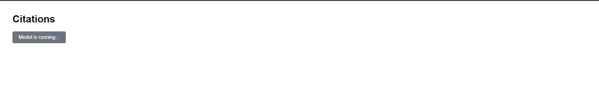
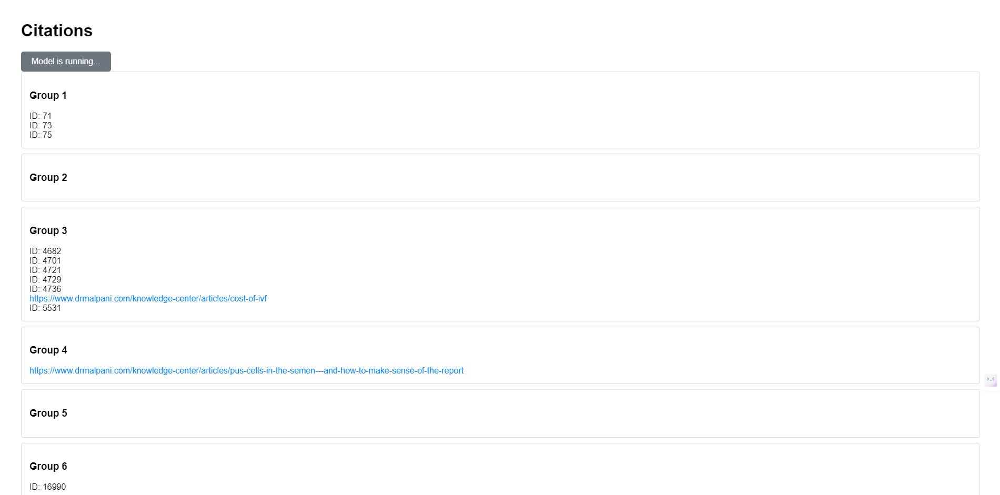

- **app.py**: The main Flask application file.
- **fetch_api_data.py**: Contains functions to fetch data from the API and identify citations.
- **templates/index.html**: The HTML template for the frontend.
- **venv/**: Virtual environment folder.
- **requirements.txt**: List of dependencies.

## Explanation

### Data Fetching

The `fetch_data_from_api` function fetches data from the API endpoint in a paginated manner. It continues fetching until there are no more pages left.

### Citation Identification

The `identify_citations` function checks the similarity between response texts and contexts using the `sentence-transformers` library. It uses cosine similarity to determine if the context is relevant to the response text, and if the similarity score exceeds a threshold, the context is considered a citation.

### Background Task

The application uses `Flask-Executor` to run the model in the background. When the "Run Model" button is clicked, it triggers an API endpoint that starts the background task.

## Screenshots

**Here you can add images or screenshots of the working application.**

)()()

## Dependencies

- Flask
- Flask-Executor
- Flask-Caching
- requests
- sentence-transformers

You can install these dependencies using the `requirements.txt` file provided.

```markdown
Flask
Flask-Executor
Flask-Caching
requests
sentence-transformers